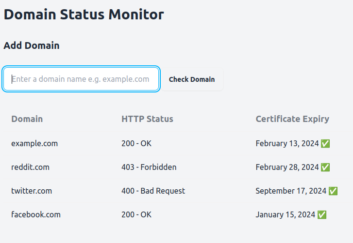

## Domain Monitor 🌐
A web application that monitors a domain's status i.e. ssl status and http response status.

### How it works
1. The application starts a server on a specified port (default: 8080).
2. Users can access the application by visiting the server's URL in a web browser.
3. The main page displays a list of monitored domains and their status.
4. Users can add new domains to monitor by entering the domain name and clicking "Check Domain".
5. The application checks the HTTP status and certificate expiry of the entered domain.
6. The status and certificate expiry information are displayed in the list of monitored domains.
7. The application periodically checks the status and certificate expiry of all monitored domains.

### How it looks


### Dependencies
[Go](https://go.dev/) 🏃‍♂️    

### Tools Used
[HTMX](https://htmx.org/)    
[DaisyUI](https://daisyui.com/)

### Installation
1. Clone the repository: git clone https://github.com/tony-nyagah/domain-monitor.git.
2. Change to the project directory: ```cd domain-monitor```.
3. Build the application: ```go build -o domain-monitor```.
4. Run the application: ```./domain-monitor```.

### Configuration
* Port: The server port can be configured by modifying the port variable in app.go.
* Template: The HTML template for the main page can be modified in templates/index.html.
* Monitoring interval: The interval for checking the status and certificate expiry of monitored domains can be modified in the application code.

### Usage
1. Open a web browser and visit the server's URL (default: http://localhost:8080).
2. The main page will display a list of monitored domains and their status.
3. To add a new domain, enter the domain name in the input field and click "Check Domain".
4. The application will check the status and certificate expiry of the entered domain.
5. The status and certificate expiry information will be displayed in the list of monitored domains.
